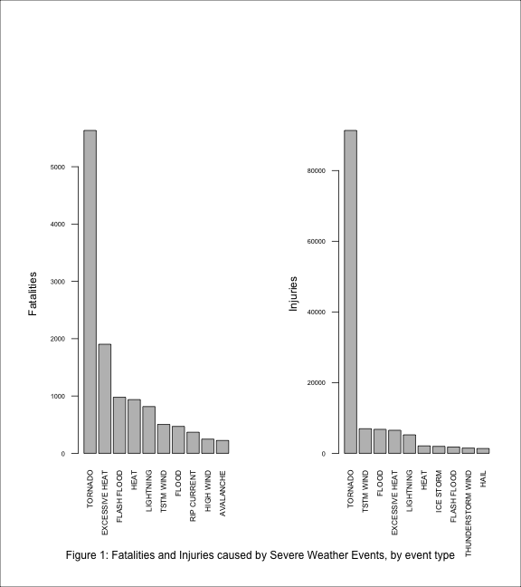
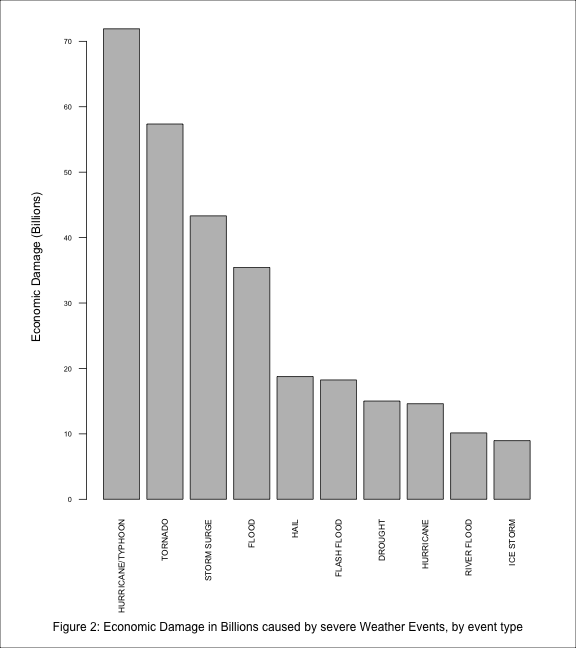

## Reproducibility
The report can be generated by copying the "PA2.Rmd" file into the
working directory of an R session and running these commands:

```
library(knitr)
knit2html("PA2.Rmd")
```

More details in the appendix.

## Synopsis
This report analyses and summarizes data from the NOAA Storm Database and analyses the consequences of severe weather events on the population health and economy. After the data is downloaded and cleaned, it is grouped by event type and summarized for the total of the statistic, the statistic being the fatalities, injuries and economic damage caused by each event type. The results are displayed as the top 10 most significant event types in terms of their effect in the form of a bar plot. The conclusions from these bar charts can be summarized as follows: The population health is most harmed by Tornados, Excessive Heat and Floods in terms of fatalities and by Tornodos, Floods and Excessive Heat in terms of Injuries, with Tornados far outstripping other causes in either case. Lightning is significant cause of fatalities and injuries (who knew?). The top causes of economic damage are Hurricanes, Tornados, Storm surge and Flooding.

## Data Processing

Data source:

* Dataset: [Data](https://d396qusza40orc.cloudfront.net/repdata%2Fdata%2FStormData.csv.bz2) [47MB]
* National Weather Service [Storm Data Documentation](https://d396qusza40orc.cloudfront.net/repdata%2Fpeer2_doc%2Fpd01016005curr.pdf)
* National Climatic Data Center Storm Events [FAQ](https://d396qusza40orc.cloudfront.net/repdata%2Fpeer2_doc%2FNCDC%20Storm%20Events-FAQ%20Page.pdf)

```r
#The warnings/messages from this section are hidden
library(readr)
library(plyr)
library(dplyr)
library(ggplot2)
```


```r
#Download the source data file, if needed.
url <- "https://d396qusza40orc.cloudfront.net/repdata%2Fdata%2FStormData.csv.bz2"
bzfile <- "repdata-data-StormData.csv.bz2"

if(!file.exists(bzfile)) {
    download.file(url,"repdata-data-StormData.csv.bz2")
}
if(!file.exists(bzfile)) {
  cat("File ",bzfile," not found...exiting\n")
  quit()
} 

data <- read.csv(bzfile)
```
Code for cleaning the data is kept in the appendix but executed here.

In this section, the data is grouped by the event type and summarized to show the total fatalities, injuries and economic damage caused by each type of the severe weather event over the entire database created from the source.

```r
#Use the exponent in the field PROPDMGEXP to interpret the PROPDMG number
# and assign to the new field PDMG
data <- data %>% mutate(PDMG = PROPDMG * (10 ^ as.numeric(PROPDMGEXP)))
data <- data %>% mutate(CDMG = CROPDMG * (10 ^ as.numeric(CROPDMGEXP)))
# Total economic damage = sum of property and crop damage. Divide by 1e9 to get results in billions.
dmg.by.type <- data %>% 
           group_by(EVTYPE) %>% 
           summarize(prop.damage.in.billions = 
           (sum(PDMG)+sum(CDMG))/1e9) %>% 
           arrange(desc(prop.damage.in.billions))

# f.by.type - Fatalities by event type,sorted
f.by.type <- data %>% 
          group_by(EVTYPE) %>% 
          summarize(fatalities = sum(FATALITIES)) %>% 
          arrange(desc(fatalities))
# in.by.type - Injuries by event type,sorted
in.by.type <- data %>% 
  group_by(EVTYPE) %>% 
  summarize(injuries = sum(INJURIES)) %>% 
  arrange(desc(injuries))

# f : Fatalities by event type,sorted
f <- f.by.type[1:10,]
f$EVTYPE = factor(f$EVTYPE,levels=unique(f$EVTYPE))
# i - Injuries by event type
i <- in.by.type[1:10,]
i$EVTYPE = factor(i$EVTYPE,levels=unique(i$EVTYPE))
#d: Property+Crop damage, by event type
d <- dmg.by.type[1:10,]
d$EVTYPE = factor(d$EVTYPE,levels=unique(d$EVTYPE))
```

## Results


```r
par(mar=c(10,6,10,2))
par(mfrow=c(1,2))
barplot(f$fatalities,
        names=f$EVTYPE,
        las=2,
        cex.names=0.7,
        cex.axis = 0.6,
        ylab="Fatalities")
barplot(i$injuries,names=i$EVTYPE,
        las=2,
        cex.names=0.7,
        cex.axis=0.6,
        ylab="Injuries")
title(sub="Figure 1: Fatalities and Injuries caused by Severe Weather Events, by event type",
     line=-3,
     outer=TRUE)
box(which="outer")
```

 

```r
par(mfrow=c(1,1))
par(mar=c(10,6,2,2))
barplot(d$prop.damage.in.billions,
        names=d$EVTYPE,
        las=2,
        cex.axis=0.6,
        cex.names=0.7,
        ylab="Economic Damage (Billions)")
title(sub="Figure 2: Economic Damage in Billions caused by severe Weather Events, by event type",
     line=-2,
     outer=TRUE)
box(which="outer")
```

 


\pagebreak

## Appendix

### Content Creation

The content of this report is authored in RStudio using R Markdown format and converted to PDF format using the **knitr** package. The R Markdown file itself can be found on [GitHub](https://github.com/swiftgurmeet/coursera-reproducible-research-peer-assessment-2)

###Data Cleaning

There are unexpected values in the PROPDMGEXP/CROPDMGEXP fields for a small fraction of the events. These are interpreted suitably. For example, if the damage (PROPDMG/CROPDMG) field is zero, the unit is irrelevant and imputed as "1." 


```r
data <- data %>% mutate(PROPDMGEXP = as.character(PROPDMGEXP))
data <- data %>% mutate(CROPDMGEXP = as.character(CROPDMGEXP))
data <- data %>% mutate(PROPDMGEXP = ifelse((PROPDMGEXP == "?" | PROPDMGEXP == "+"), 0, PROPDMGEXP))
data <- data %>% mutate(PROPDMGEXP = ifelse((PROPDMGEXP == "M" | PROPDMGEXP == "m"), 6, PROPDMGEXP))
data <- data %>% mutate(PROPDMGEXP = ifelse((PROPDMGEXP == "B" | PROPDMGEXP == "b"), 9, PROPDMGEXP))
data <- data %>% mutate(PROPDMGEXP = ifelse((PROPDMGEXP == "K" | PROPDMGEXP == "k"), 3, PROPDMGEXP))
data <- data %>% mutate(PROPDMGEXP = ifelse((PROPDMGEXP == "H" | PROPDMGEXP == "h"), 2, PROPDMGEXP))
data <- data %>% mutate(PROPDMGEXP = ifelse((PROPDMGEXP == "" | PROPDMGEXP == "-"), 0, PROPDMGEXP))
data <- data %>% mutate(CROPDMGEXP = ifelse((CROPDMGEXP == "" | CROPDMGEXP == "?"), 0, CROPDMGEXP))
#Use PROPDGM exponent if CROPDMG exponent is zero: best option after looking at the relevant rows
data <- data %>% mutate(CROPDMGEXP = ifelse((CROPDMGEXP == "0"), PROPDMGEXP, CROPDMGEXP))
data <- data %>% mutate(CROPDMGEXP = ifelse((CROPDMGEXP == "M" | CROPDMGEXP == "m"), 6, CROPDMGEXP))
data <- data %>% mutate(CROPDMGEXP = ifelse((CROPDMGEXP == "B" | CROPDMGEXP == "b"), 9, CROPDMGEXP))
data <- data %>% mutate(CROPDMGEXP = ifelse((CROPDMGEXP == "K" | CROPDMGEXP == "k"), 3, CROPDMGEXP))
# Assume CA flood event on 1/1/2006 has damage in millions not billions.
# See http://www.water.ca.gov/floodsafe/ca-flood-preparedness/fpw-day3.cfm
data[605953,"PROPDMGEXP"] <- 6
```

### Notes:

- The focus is on reproduciblity aspects, the report could be improved a lot in other settings.
- The source data is questionable in many ways.
- Inflation is not considered for the economic damage. This has the effect of reducing the weightage of the older events, which I think is ok.
- No caching is used. Reproducing the report takes only a couple of minutes including downloading the file.
